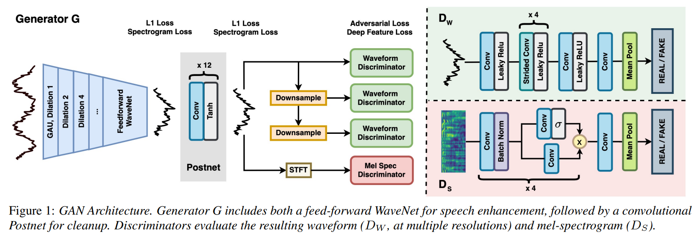

# HiFiGAN Denoiser
This is a Unofficial Pytorch implementation of the paper [HiFi-GAN: High Fidelity Denoising and Dereverberation Based on Speech Deep Features in Adversarial Networks](https://arxiv.org/pdf/2006.05694).


## Citations
```
@misc{su2020hifigan,
      title={HiFi-GAN: High-Fidelity Denoising and Dereverberation Based on Speech Deep Features in Adversarial Networks}, 
      author={Jiaqi Su and Zeyu Jin and Adam Finkelstein},
      year={2020},
      eprint={2006.05694},
      archivePrefix={arXiv},
      primaryClass={eess.AS}
}
```

## Requirement
Tested on Python 3.6
```bash
pip install -r requirements.txt
```

## Train & Tensorboard

- `python train.py -c [config yaml file]`
  
- `tensorboard --logdir log_dir`

## Inference

- `python inference.py -p [checkpoint path] -i [input wav path]`

## Checkpoint :
- WIP

## References
- [HiFi-GAN: High Fidelity Denoising and Dereverberation Based on Speech Deep Features in Adversarial Networks](https://arxiv.org/pdf/2006.05694)
- [Denoising Wavenet Generator](https://github.com/Sytronik/denoising-wavenet-pytorch)
- [StarGAN VC Discriminator](https://github.com/hujinsen/pytorch-StarGAN-VC)
- [Melgan Multi-Scale Discriminator](https://github.com/seungwonpark/melgan)
- [Parallel Wavegan](https://github.com/kan-bayashi/ParallelWaveGAN)
- [HiFi GAN vocoder's MSD and multi-gpu training code](https://github.com/jik876/hifi-gan)

